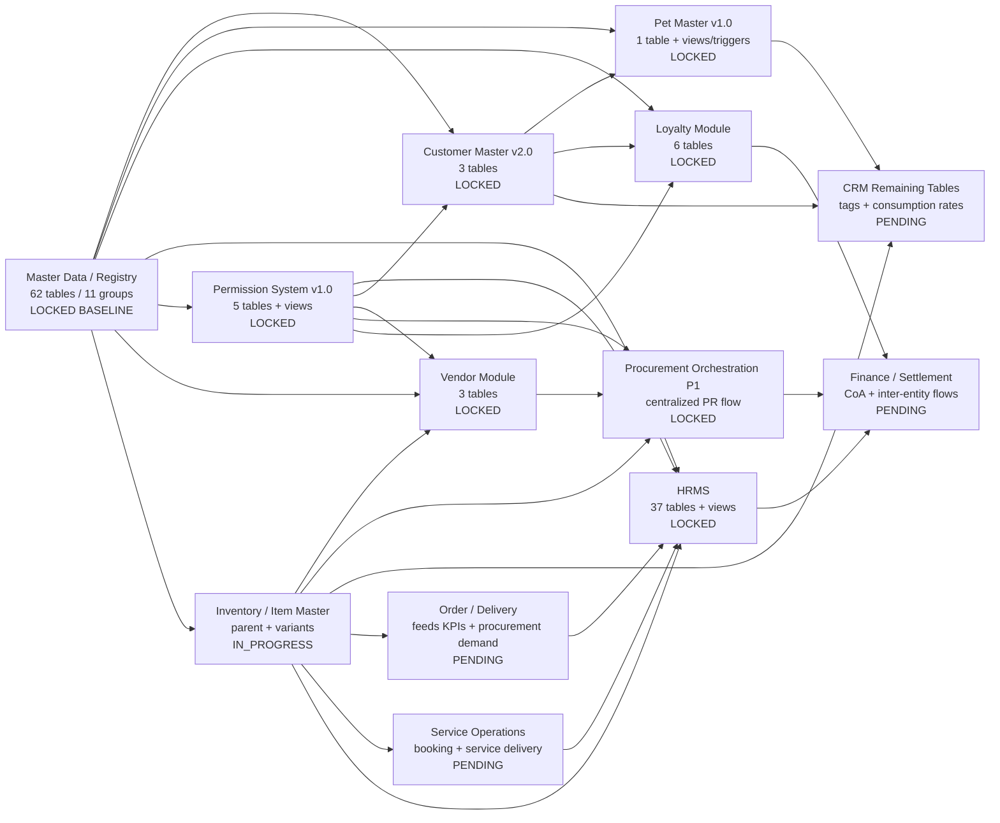
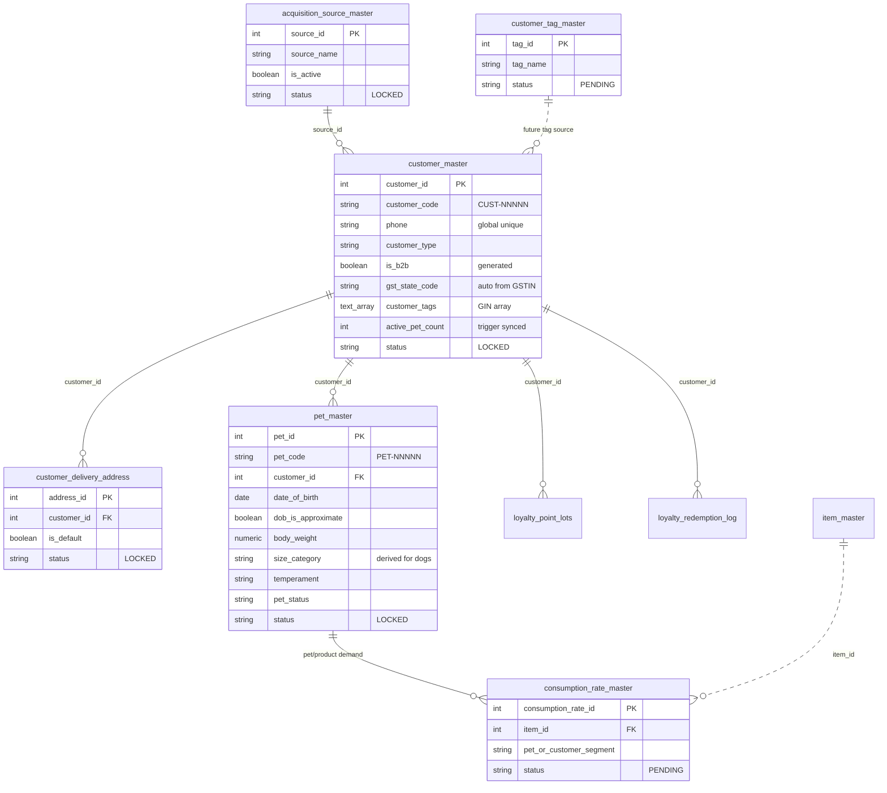
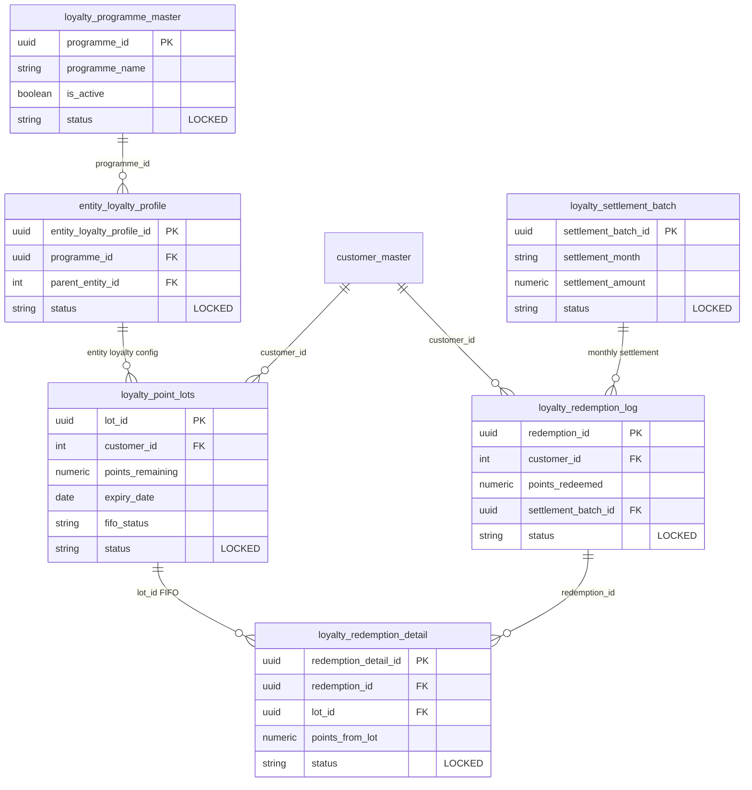
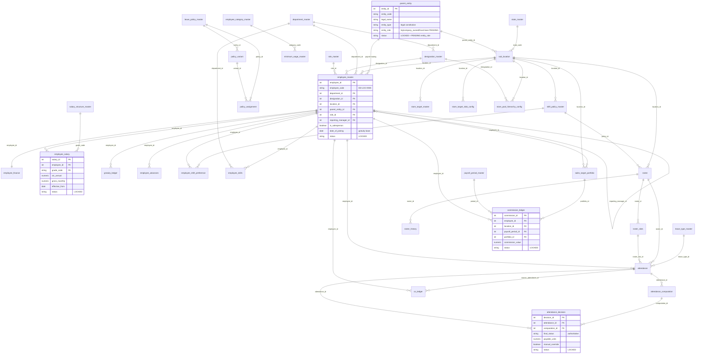
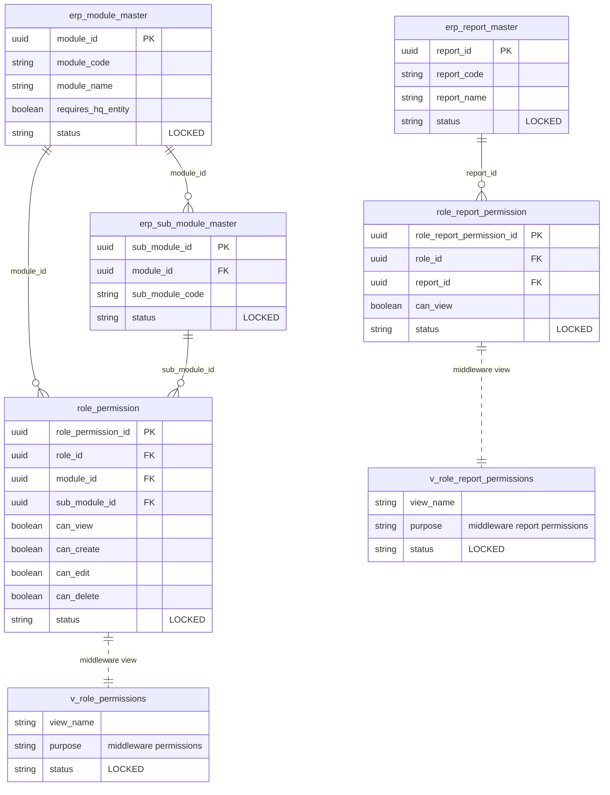
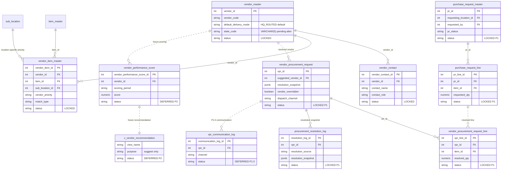
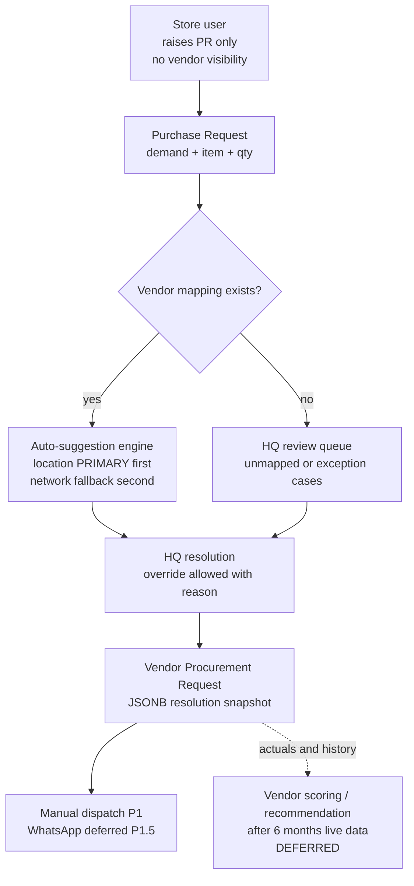
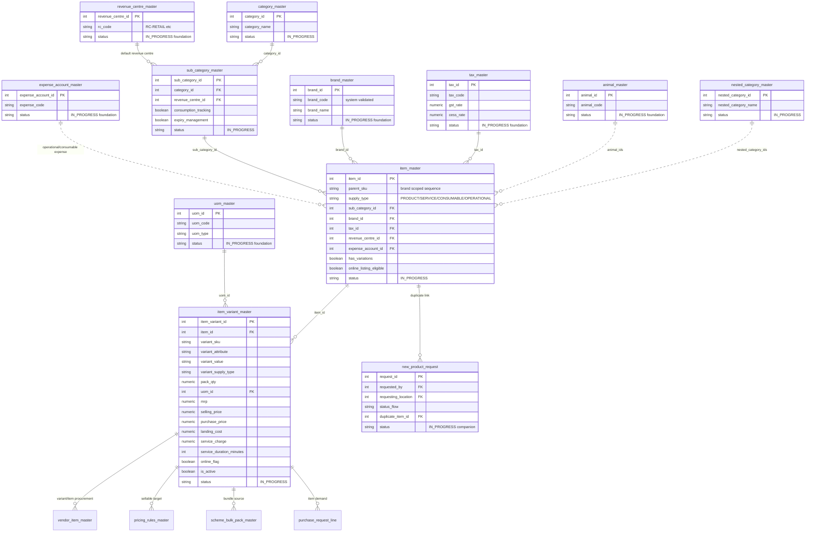
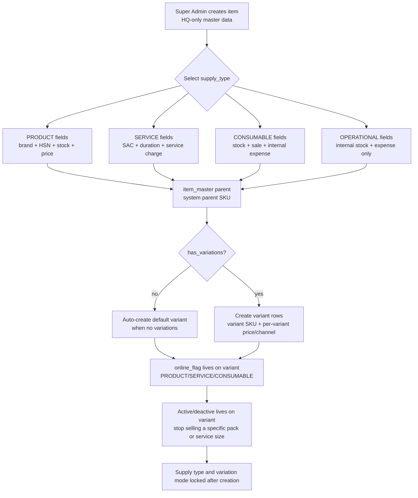
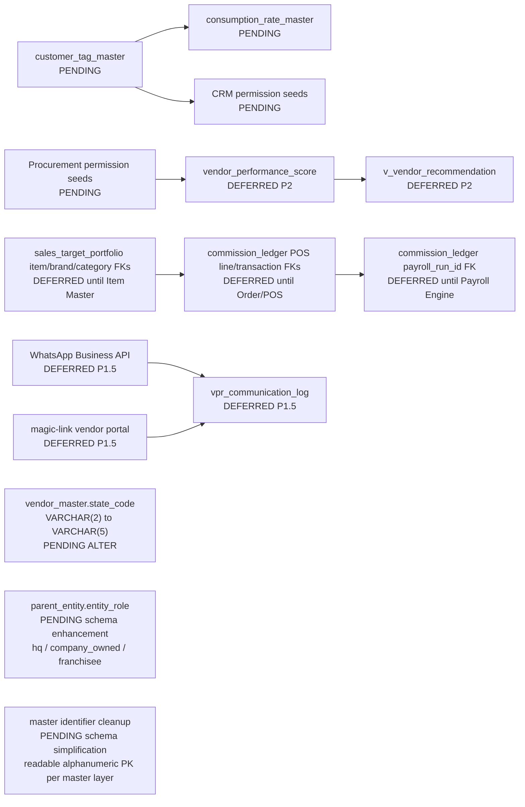

# Indipet ERP Schema Map

Canonical source: project memory for `IndipetERP_devTeam`, the latest `Indipet ERP` chat through 2026-05-10, and HRMS phase schema files shared in May 2026.

This map intentionally shows current/locked schema and active design decisions. Older drafts and stale alternatives are not included unless they explain a current deferred item.

## Status Legend

| Status | Meaning |
|---|---|
| LOCKED | Built/accepted schema or module decision |
| IN_PROGRESS | Active design/build area, not yet fully locked |
| PENDING | Required next work, not yet built/seeded |
| DEFERRED | Explicitly postponed until a later phase or data maturity trigger |

## Overall ERP Module Map

## Cross-System Rules

| Area | Canonical decision |
|---|---|
| Entity terminology | `parent_entity`, not `entity_master`; `sub_location`, not `outlet_master` |
| Entity classification | `parent_entity.entity_type` stores legal constitution; pending `parent_entity.entity_role` must store business role: `hq`, `company_owned`, or `franchisee` |
| Master identifiers | Each master layer should keep one readable alphanumeric text primary identifier, such as `IPL101` or `IPL101-SLT201`; duplicate editable code/short-code fields should be removed or generated-only unless finance/integration explicitly needs them |
| Week off selection | UI should expose `location_operating_hours.day_of_week` as `Week Off Day` with an ISO weekday dropdown: `1 Monday` through `7 Sunday`; `No Weekly Off` should store no closed-day row / no week-off value |
| Location operating hours | Base hours stay at location level: office official/operational hours can match, stores can have broader operational hours; `shift_policy_id` is deferred until shift policy setup is finalized |
| Holiday calendar | `holiday_calendar` stores uniform state/company holidays by `state_code`; Kolkata FY 2026-2027 case master uses a compact 13-holiday list with `state_code = WB`, blank `location_id`, `is_closed = true` only for Durga Puja and Doljatra, and `co_eligible = true` for all listed holidays |
| Leave type master | `leave_type_master` stores stable leave categories; FY 2026-2027 case master seeds CL, SL, EL, CO, LOP, ML, and PTL before leave policy setup |
| Leave policy master | `leave_policy_master` stores the FY policy wrapper; FY 2026-2027 case master uses HR/Admin approval, `holiday_calendar`, simultaneous leave blocking, `co_credit_trigger = Attendance`, CO auto-credit, 90-day CO expiry, and 4-hour CO minimum |
| Policy variant | `policy_variant` stores group-wise entitlement JSON under the FY leave policy; case master seeds HQ standard, store standard, probation, and contractor no-paid-leave variants |
| Policy assignment | `policy_assignment` maps variants to supported groups; case master assigns HQ by location, stores by location, contractual vet policy by Veterinary Doctor designation, and adds a probation employee-level placeholder until Employee Master exists |
| Location service config | Current table is `location_service_config(config_id, location_id, service_code, is_active, activated_by)`; `service_code` references `service_type_master.service_code`; HQ is office-only unless explicitly configured |
| Customer identity | Phone is the global unique customer identifier |
| Customer code | System code remains `CUST-NNNNN`; location-style display code such as `DP000155` is derived |
| Pet code | System code remains `PET-NNNNN`; display code such as `DP000155_001` is derived |
| Audit fields | `created_by INTEGER NOT NULL DEFAULT 0`, `created_at NOT NULL DEFAULT CURRENT_TIMESTAMP`, nullable `modified_by`, `modified_at` |
| FK style | Inline `REFERENCES`; avoid named `CONSTRAINT` blocks unless needed for checks/uniques |
| Code generation | `XX-NNNNN` style via database trigger unless a module has a newer locked rule |
| Loyalty eligibility | B2B customers are structurally excluded by `fn_check_loyalty_eligibility` |
| Workflow discipline | Conflict check first, raise issue, propose solve, confirm before implementation |

## Customer, Pet, and CRM Layer

### Customer/Pet Notes

- `acquisition_source_master`, `customer_master`, and `customer_delivery_address` are locked as Customer Master v2.0.
- `customer_master.phone` is the global unique identifier; POS can capture only name + phone first and enrich later.
- `pet_master.customer_id` uses `ON DELETE RESTRICT`; age is always derived from `date_of_birth`, never stored.
- `active_pet_count` is synchronized back to `customer_master` by trigger.
- CRM pending work: `customer_tag_master`, `consumption_rate_master`, and CRM permission seeds.

## Loyalty Layer

### Loyalty Notes

- Loyalty replaced the earlier `customer_points_ledger` idea.
- FIFO lots are the accounting and redemption source of truth.
- B2B customers are blocked by `fn_check_loyalty_eligibility`.
- Monthly inter-entity settlement runs through IPL Loyalty Clearing.
- CoA references noted in design: 6400, 2300, 7600, 7700, 7800.

## HRMS Layer

### HRMS Table Groups

| Group | Tables / views | Status |
|---|---|---|
| Core employee registry | `state_master`, `parent_entity`, `sub_location`, `department_master`, `designation_master`, `role_master`, `employee_master`, `employee_finance` | LOCKED |
| Leave, shift, compliance, payroll policy | `holiday_calendar`, `leave_type_master`, `employee_category_master`, `leave_policy_master`, `policy_variant`, `policy_assignment`, `shift_policy_master`, `pt_slab_master`, `minimum_wage_master`, `payroll_period_master`, `salary_structure_master`, `state_compliance_master` | LOCKED |
| Preferences and capability | `employee_shift_preference`, `employee_skills` | LOCKED |
| Roster and attendance | `roster`, `roster_slots`, `roster_history`, `attendance`, `co_ledger`, `attendance_computation`, `attendance_decision`, `v_co_balance`, `v_payroll_input` | LOCKED |
| Performance and incentives | `sales_target_portfolio`, `store_target_master`, `store_target_slab_config`, `store_pool_hierarchy_config`, `commission_ledger`, `v_commission_payroll` | LOCKED |
| Salary, gratuity, advances, exit | `employee_salary`, `gratuity_ledger`, `employee_advances`, `v_fnf_settlement` | LOCKED |

### HRMS Notes

- HRMS currently reconciles to 37 SQL tables across Phase 1 through Phase 7, plus payroll/FnF/commission/CO views.
- `employee_master` is the HRMS anchor and drives attendance, roster, leave, payroll, commission, gratuity, advances, and FnF.
- Employee Master seed rule: case master starts with 26 active people across HQ and four stores, including store keyholders, sales staff, grooming staff, clinic staff, two probation employees, and one contractual veterinary doctor.
- Employee Master should include `is_reporting_manager_eligible` as a boolean checkbox/tick field. `reporting_manager_id` dropdown should list active employees with this tick enabled, then apply location/area/HQ visibility rules and block self-reporting.
- Employee Category is treated as statutory wage/skill class for `minimum_wage_master.employee_category_code`: `MGT601` managerial/supervisory, `ADM602` administrative/clerical, `HSK603` highly skilled, `SKD604` skilled, `SSK605` semi-skilled, `USK606` unskilled.
- Grade authority is controlled through `designation_master.grade_code`, not Employee Category. Employee Category remains a wage/compliance class only.
- `designation_master.override_level` should use the same grade-code dropdown (`A`, `B`, `C`, `D`) for override authority; blank means the designation has no override power. Runtime override must check both assigned role permission and the employee's designation grade, so Role Manager alone cannot create override authority.
- Employee Master menu alignment: `employee_type` uses `Full Time` or `Contractor`, `employment_subtype` uses `Permanent`, `Probation`, or `Contractual`, `shift_preference_mode` uses `Fixed`, `Rotational`, or `Flexible`, and `status` uses `Active`.
- Employee Profile companion-layer recommendation: keep `employee_master` as the anchor and expose accordion sections for profile checklist, personal details, address, emergency contact, statutory/KYC, finance, documents, skills, shift preferences, and lifecycle.
- Current schema already has `employee_finance`, `employee_skills`, and `employee_shift_preference`; proposed new companion tables are needed for personal details, address, emergency contact, statutory/nominee detail, and documents.
- `parent_entity.entity_type` is legal constitution only (`company`, `llp`, `partnership`, `proprietorship`). It must not be overloaded for HQ/franchisee classification.
- Pending schema enhancement: add `parent_entity.entity_role` with controlled values `hq`, `company_owned`, and `franchisee`; payroll/entity classification should read this field once implemented.
- Payroll routing is derived from `employee_master.parent_entity_id -> parent_entity`; no redundant payroll entity field is stored.
- `employee_master.date_of_joining` is the single joining date and gratuity service-date base.
- Shift Policy Master seed rule: HQ has one 9-hour office shift, and each retail store has two overlapping 9-hour fixed shifts (`10:30-19:30` and `12:30-21:30`) against `shift_policy_master.location_id`.
- Shift policy menu alignment: `shift_type = Fixed`, `coverage_mode = Single/Dual`, `roster_cycle = Weekly/Monthly`, `weekly_off_pattern = Fixed/Rotational`, `holiday_working_policy = Co Credit/None`, and `policy_status = Active`.
- Store weekly off is roster-based, so `shift_policy_master.weekly_off_day` stays blank for stores; HQ uses ISO day `7` for Sunday. Current UI still shows this as text/smallint, not an ISO dropdown.
- `shift_policy_master.co_credit_trigger` is boolean in the current schema: stores use `true` for calendar-controlled holiday/CO handling, while the HQ office shift uses `false`.
- `attendance_computation` is a pure measurement layer; `attendance_decision` is the authoritative payable-status layer and feeds `v_payroll_input`.
- `employee_skills` is intentionally separate from `designation_master`; service booking and groomer commission should read skills/capabilities, not only formal designation.
- Performance audit lives mainly in `sales_target_portfolio`, `store_target_master`, `store_target_slab_config`, `store_pool_hierarchy_config`, and `commission_ledger`.
- HRMS-to-order/POS links are deferred FKs: `commission_ledger.pos_transaction_id`, `commission_ledger.pos_line_item_id`, and item/category/brand portfolio references.
- HRMS-to-finance links are action-level: payroll input, commission payable, gratuity provision/payment, salary advances, and FnF settlement.
- Location audit support is in Phase 8 via `location_audit_log`; it connects to HRMS through `employee_master` as actor/configurer but keeps `changed_by` as non-FK integer so audit history survives employee deletion.

## Permission Layer

### Permission Notes

- `erp_module_master` has 19 modules seeded, including `MOD-PURCHASE`.
- `erp_sub_module_master` has 70+ sub-modules, including `SUB-PUR-VENDORS`, `SUB-PUR-PO`, `SUB-PUR-GRN`, and `SUB-PUR-PAYMENTS`.
- `erp_report_master` has 29 reports.
- `MOD-LOYALTY` and `MOD-SETTINGS` require HQ entity access.
- Procurement permission seeds remain pending.

## Vendor and Procurement Layer

### Procurement Flow

### Vendor/Procurement Notes

- `vendor_location_assignment` was dropped; dynamic item x location x priority mapping lives in `vendor_item_master`.
- Stores never manually select vendors and should not see vendor information.
- HQ owns vendor resolution, override, and dispatch.
- P1 states include 7 core states plus `CANCELLED` and `NEEDS_HQ_REVIEW`.
- Vendor recommendation P2 is suggest-only and never overrides hardcoded routing.
- Pending ALTER: `vendor_master.state_code` from `VARCHAR(2)` to `VARCHAR(5)`.

## Item Master / Inventory Layer

### Item Master Decisions From Latest Chat

| Decision | Current value |
|---|---|
| `supply_type` | Four values: `PRODUCT`, `SERVICE`, `CONSUMABLE`, `OPERATIONAL` |
| Customer display code | Derived from location-style display, system code remains `CUST-NNNNN` |
| Pet display code | Derived from customer display + sequence, system code remains `PET-NNNNN` |
| Revenue centre | On `sub_category_master`, inherited by item |
| Variations | Parent `item_master` plus child `item_variant_master` |
| Service variants | Allowed from the start |
| Variant model | Single-axis initially; multi-axis deferred |
| Pricing location | Every sellable thing is a variant; default variant auto-created when `has_variations = FALSE` |
| SKU generation | System-generated only, brand-scoped parent sequence |
| Brand code | System-validated and collision-resolved at creation |
| `online_flag` | Variant-level for product/service/consumable |
| Active/deactive control | Variant-level through `item_variant_master.is_active`; parent remains the catalog definition |
| Operational online sale | Locked false because it has no revenue infrastructure |

### Item Master Flow

### SKU Format Reference

| Level | Format | Example |
|---|---|---|
| Parent item | `[BRAND_CODE]-[SEQ_WITHIN_BRAND]` | `RC-489` |
| Variant | parent + `-[PACK_QTY][UOM_CODE]` or service variant suffix | `RC-489-10KG` |
| Bundle/scheme | variant + `-P[BUNDLE_QTY]` | `RC-489-10KG-P12` |

No human types a SKU. Brand codes are system-validated and collision-resolved. Parent and variant SKUs are generated by triggers after insert.

## Deferred and Pending Work

## Source Coverage Check

| Included area | Source basis | Status |
|---|---|---|
| Customer Master v2.0 | Project memory | LOCKED |
| Pet Master v1.0 | Project memory | LOCKED |
| Loyalty Module | Project memory | LOCKED |
| HRMS table count, performance layer, payroll/FnF views, and audit posture | Phase 1-8 HRMS SQL files + schema map refresh, 2026-05-13 | LOCKED |
| Permission System v1.0 | Project memory | LOCKED |
| Vendor Module | Project memory + latest ERP chat | LOCKED |
| Procurement Orchestration P1 | Project memory + latest ERP chat | LOCKED |
| Item Master | Latest `Indipet ERP` chat, 2026-05-10 | IN_PROGRESS |
| Parent entity business role | User-identified schema gap during case-master preparation, 2026-05-26 | PENDING |
| Master identifier simplification | User-identified schema simplification during case-master preparation, 2026-05-26: use readable alphanumeric text IDs such as `IPL101`, `SCP102`, and `IPL101-SLT201` | PENDING |
| CRM tags and consumption rate | Project memory | PENDING |
| Vendor scoring and WhatsApp | Project memory | DEFERRED |
